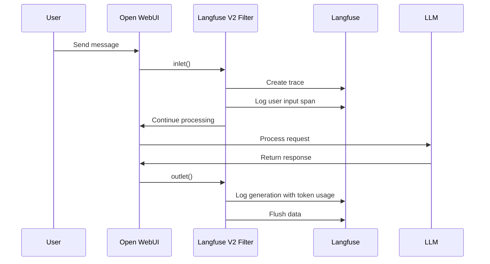

# Langfuse V2


[](https://github.com/shakerbr)
[](https://opensource.org/licenses/MIT)

> A stable filter for comprehensive LLM observability and tracing using Langfuse, aligned with the v2 Langfuse Python package.

## Overview

Langfuse V2 is a filter function for Open WebUI that provides seamless integration with [Langfuse](https://langfuse.com/), an open-source observability platform for LLM applications. This filter automatically captures and logs all chat interactions, enabling detailed tracing, debugging, and analytics of your AI conversations.

## Features

| Feature | Description |
|---------|-------------|
| 🔍 **Trace Creation** | Creates traces for each chat session with unique identifiers |
| 📝 **User Input Logging** | Captures user messages as span events for complete conversation tracking |
| 🤖 **LLM Response Logging** | Records assistant responses as generation events with full context |
| 📊 **Token Usage Tracking** | Extracts and logs input/output token counts for cost analysis |
| 🏷️ **Model Metadata** | Tracks model ID and name for each generation |
| 🏷️ **Tag Management** | Automatic tagging with "open-webui" and task names |
| 🔧 **Debug Mode** | Optional verbose logging for troubleshooting |

## Configuration (Valves)

| Parameter | Type | Default | Description |
|-----------|------|---------|-------------|
| `secret_key` | `str` | `LANGFUSE_SECRET_KEY` env or `"your-secret-key-here"` | Langfuse secret key for authentication |
| `public_key` | `str` | `LANGFUSE_PUBLIC_KEY` env or `"your-public-key-here"` | Langfuse public key for authentication |
| `host` | `str` | `LANGFUSE_HOST` env or `"https://cloud.langfuse.com"` | Langfuse server URL (self-hosted or cloud) |
| `insert_tags` | `bool` | `True` | Whether to insert automatic tags on traces |
| `use_model_name_instead_of_id_for_generation` | `bool` | `USE_MODEL_NAME` env or `False` | Use model name instead of ID in generation logs |
| `debug` | `bool` | `DEBUG_MODE` env or `False` | Enable debug logging for troubleshooting |

## How to Use

1. **Configure Langfuse API Keys**: Obtain your API keys from Langfuse (see below)
2. **Add to Open WebUI**: Paste the filter code into Open WebUI's Functions section
3. **Set Valves**: Configure your API keys through the Open WebUI interface
4. **Start Chatting**: The filter automatically activates on all chat messages

### Getting Langfuse API Keys

> [!NOTE]
> You can use either Langfuse Cloud or self-host Langfuse on your own infrastructure.

#### Option 1: Langfuse Cloud
1. Sign up at [cloud.langfuse.com](https://cloud.langfuse.com)
2. Navigate to **Project Settings** → **API Keys**
3. Copy your **Secret Key** and **Public Key**

#### Option 2: Self-Hosted Langfuse
1. Deploy Langfuse using Docker or your preferred method
2. Access your Langfuse instance and create a project
3. Navigate to **Project Settings** → **API Keys**
4. Copy your **Secret Key** and **Public Key**
5. Set the `host` valve to your self-hosted URL

### Configuration Examples

**Environment Variables (Recommended)**:
```bash
LANGFUSE_SECRET_KEY=sk-lf-xxxxx
LANGFUSE_PUBLIC_KEY=pk-lf-xxxxx
LANGFUSE_HOST=https://cloud.langfuse.com  # Or your self-hosted URL
DEBUG_MODE=false
USE_MODEL_NAME=false
```

**Via Open WebUI Valves**:
- Set `secret_key` to your Langfuse secret key
- Set `public_key` to your Langfuse public key  
- Set `host` to your Langfuse instance URL
- Enable `debug` for troubleshooting if needed

## Showcase


*The Langfuse dashboard displaying traces, spans, and generations from Open WebUI conversations.*

## How It Works



## Requirements

- Open WebUI version 0.6.32 or higher
- Langfuse Python package (< 3.0.0) - automatically installed

## Troubleshooting

> [!TIP]
> Enable `debug` mode in the valves to see detailed logging in your Open WebUI logs.

| Issue | Solution |
|-------|----------|
| "Langfuse credentials incorrect" | Verify your secret and public keys are correct |
| Traces not appearing | Check that Langfuse host URL is accessible |
| Token counts missing | Ensure your LLM backend provides usage statistics |

## Author

**shakerbr**  
[GitHub](https://github.com/shakerbr)

## License

MIT License - See [LICENSE](LICENSE) for details.

---

> [!IMPORTANT]
> This filter processes all chat messages. Ensure your Langfuse instance is properly secured and your API keys are kept confidential.