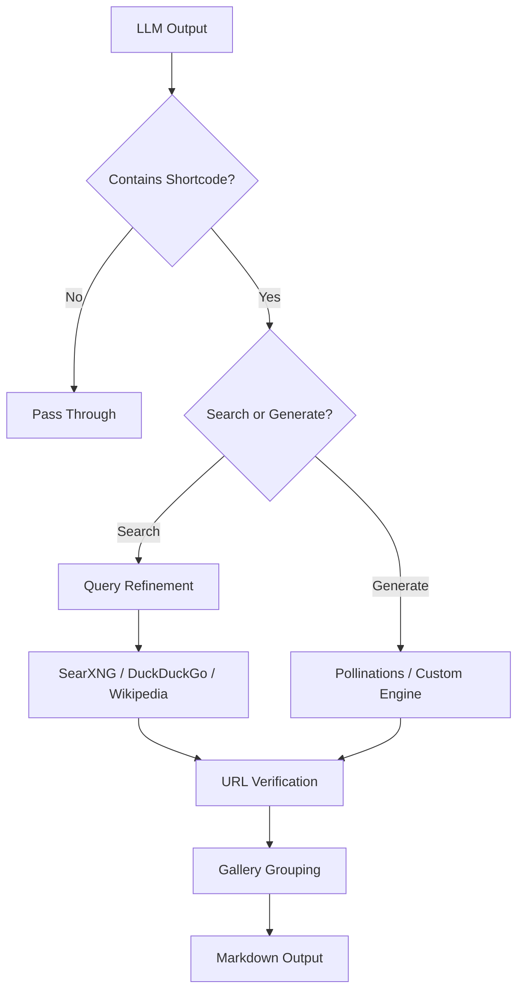

# Smart Image Shortcode Renderer


[](https://github.com/shakerbr)
[](https://opensource.org/licenses/MIT)

> **Inlet/Outlet filter** that allows LLMs to output `{{{img{Search/Generate: query}img}}}` shortcodes, automatically replacing them with real images and grouping consecutive tags into carousels.

---

## Features

- 🔍 **Image Search** — Fetches images from SearXNG, DuckDuckGo, or Wikipedia API
- 🎨 **Image Generation** — Supports Pollinations AI and custom OpenAI-compatible APIs
- 🧠 **Smart Query Refinement** — Builds multiple search variations for better results
- ✅ **URL Verification** — Validates image URLs before display
- 🖼️ **Gallery Rendering** — Groups consecutive images into markdown tables
- ⏳ **Progressive Loading** — Real-time status updates during image processing
- 📝 **Directive Injection** — Invisibly instructs LLM about image capabilities
- 🚫 **Code Block Awareness** — Skips shortcodes inside code blocks

---

## Configuration (Valves)

| Parameter | Type | Default | Description |
|-----------|------|---------|-------------|
| `SEARXNG_BASE_URL` | `str` | `"http://searxng:8080"` | Base URL for SearXNG instance |
| `CUSTOM_ENGINE_BASE_URL` | `str` | `"https://api.openai.com/v1"` | Custom image API URL |
| `CUSTOM_ENGINE_API_KEY` | `str` | `""` | API key for custom engine |
| `generation_engine` | `str` | `"both"` | Engine: `"pollinations"`, `"custom"`, or `"both"` |
| `custom_models` | `str` | `"imagen-4.0-fast-generate-001"` | Comma-separated models for custom engine |
| `verify_timeout` | `int` | `5` | Timeout for URL verification (seconds) |
| `pollinations_timeout` | `int` | `15` | Timeout for Pollinations generation |
| `custom_engine_timeout` | `int` | `30` | Timeout for custom engine API |
| `search_refinement_queries` | `int` | `3` | Number of query variations to try |

---

## How to Use

The LLM outputs shortcodes in messages, and the filter automatically processes them:

| Shortcode | Action |
|-----------|--------|
| `{{{img{Search: Eiffel Tower night}img}}}` | Fetches image from search engines |
| `{{{img{Generate: sunset over mountains}img}}}` | Generates image via AI |

### Example

```markdown
Here's a beautiful sunset I generated for you:

{{{img{Generate: sunset over mountains with vibrant orange sky}img}}}
```

The filter will:
1. Detect the shortcode
2. Send the prompt to the configured generation engine
3. Verify the resulting image URL
4. Replace the shortcode with the actual image

---

## Backend Setup

### SearXNG (Image Search)

For image search functionality, you'll need a SearXNG instance:

```yaml
# docker-compose.yml
version: '3'
services:
  searxng:
    image: searxng/searxng:latest
    ports:
      - "8080:8080"
    environment:
      - SEARXNG_BASE_URL=http://searxng:8080
    volumes:
      - ./searxng:/etc/searxng
    restart: unless-stopped
```

> [!TIP]
> SearXNG provides privacy-respecting metasearch capabilities. Configure your instance to enable image search for optimal results.

### Pollinations AI (Image Generation)

[Pollinations AI](https://pollinations.ai/) offers free image generation without API keys:

- No registration required
- Free tier with generous limits
- Supports various models and styles

For production use, consider setting up a custom OpenAI-compatible endpoint.

### Custom OpenAI-Compatible API

Configure your own image generation backend:

| Valve | Value |
|-------|-------|
| `CUSTOM_ENGINE_BASE_URL` | Your API endpoint (e.g., `https://your-api.com/v1`) |
| `CUSTOM_ENGINE_API_KEY` | Your API key |
| `generation_engine` | `"custom"` or `"both"` |
| `custom_models` | Available models (comma-separated) |

---

## Showcase


> [!NOTE]
> Replace `image-placeholder.png` with an actual screenshot demonstrating the filter in action.

---

## Technical Details

### Processing Flow



### Code Block Handling

The filter intelligently skips processing shortcodes inside:

- Triple backtick code blocks (` ``` `)
- Inline code spans (`` `code` ``)
- Prevents unintended image generation from code examples

---

## Installation

1. Copy the `smart-image-shortcode-renderer.py` file
2. Open Open WebUI → Admin Panel → Functions
3. Click the `+` button to add a new function
4. Paste the code and save
5. Enable the filter in your model settings

---

## Troubleshooting

| Issue | Solution |
|-------|----------|
| No images returned | Verify SearXNG is running and accessible |
| Generation timeout | Increase `pollinations_timeout` or `custom_engine_timeout` |
| Invalid URLs | Check `verify_timeout` settings and network connectivity |
| Custom engine errors | Verify API key and endpoint URL are correct |

---

## Contributing

Contributions are welcome! Feel free to submit issues or pull requests.

---

## License

MIT License — See [LICENSE](LICENSE) for details.

---

<p align="center">
  Made with ❤️ for the <strong>self-hosting community</strong>
</p>